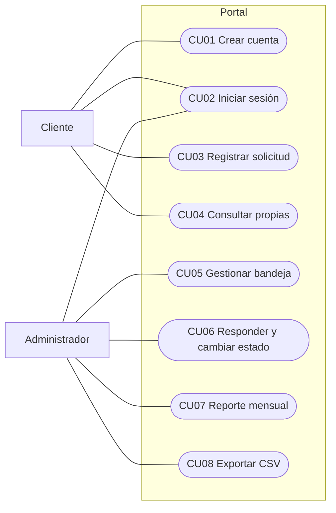

# Diagrama de casos de uso

```mermaid
flowchart LR
 C[Cliente]
 A[Administrador]
 subgraph Portal
 U1([CU01 Crear cuenta])
 U2([CU02 Iniciar sesión])
 U3([CU03 Registrar solicitud])
 U4([CU04 Consultar propias])
 U5([CU05 Gestionar bandeja])
 U6([CU06 Responder y cambiar estado])
 U7([CU07 Reporte mensual])
 U8([CU08 Exportar CSV])
 end
 C --- U1
 C --- U2
 C --- U3
 C --- U4
 A --- U2
 A --- U5
 A --- U6
 A --- U7
 A --- U8
```

La base de datos es componente interno. Crear administradores es una tarea de instalación por consola y no se expone al cliente.
