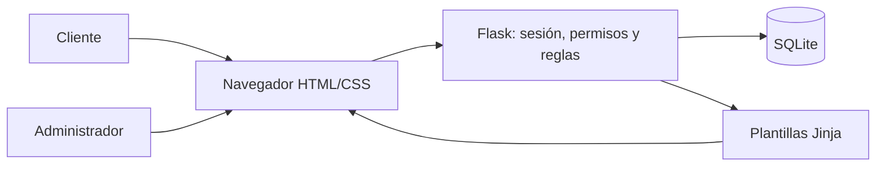
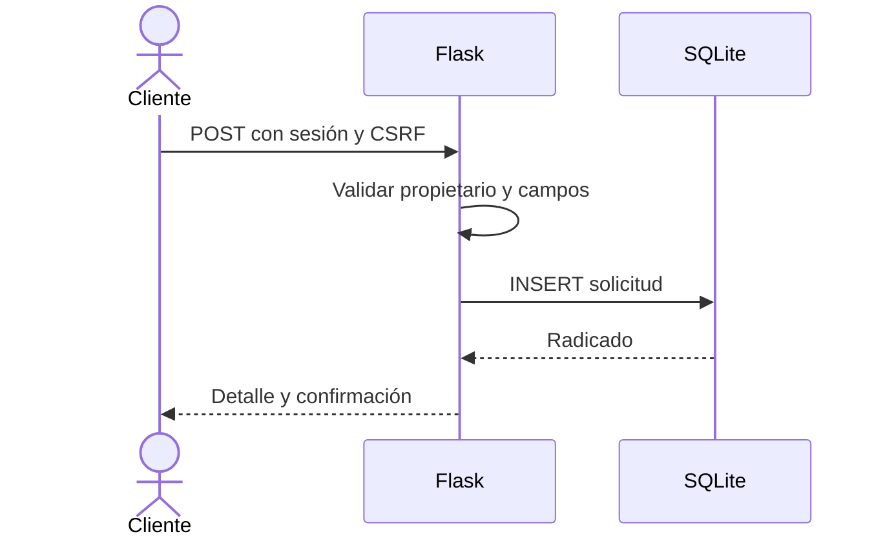
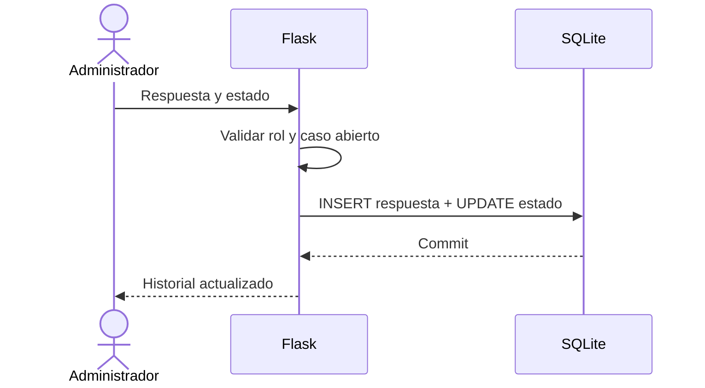
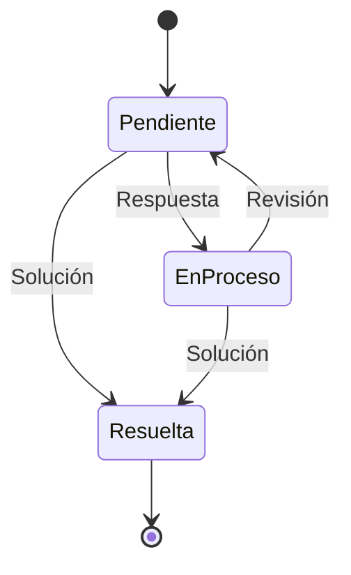

# Arquitectura y secuencias

La arquitectura conserva la separación por capas de NEXORA, simplificada a un monolito para la entrega.

## Registrar solicitud

## Responder

## Estados

Las rutas, reglas y campos se detallan en `app.py`, `schema.sql` y `modelo de datos.md`.
